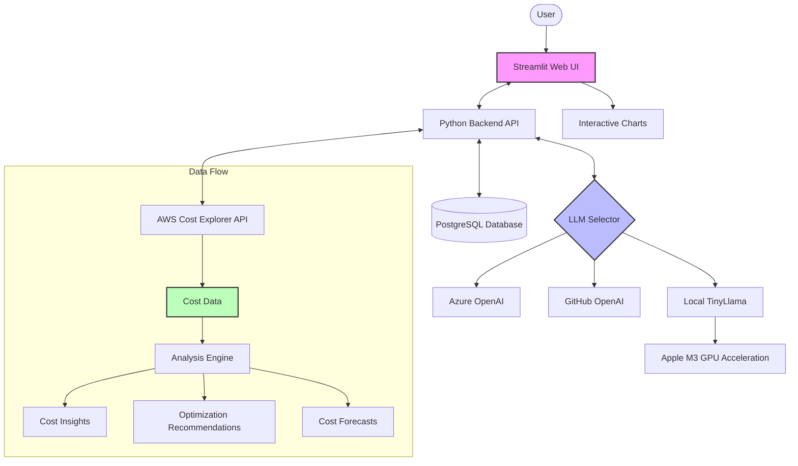
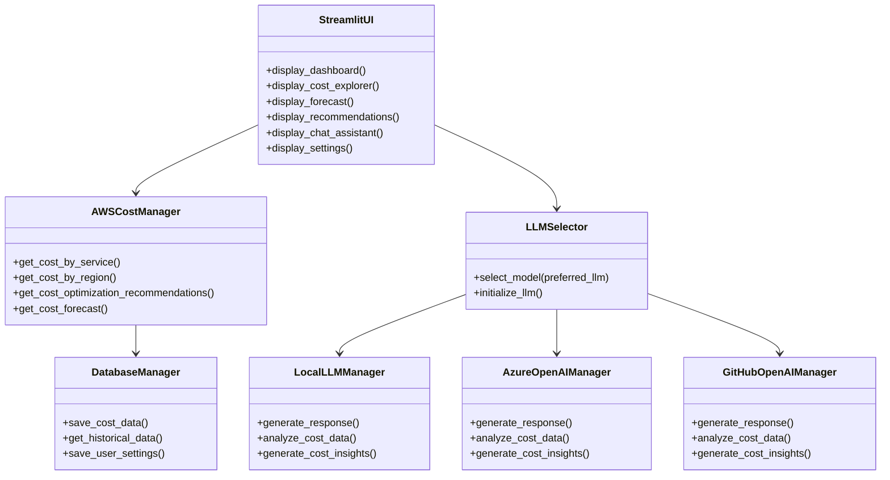
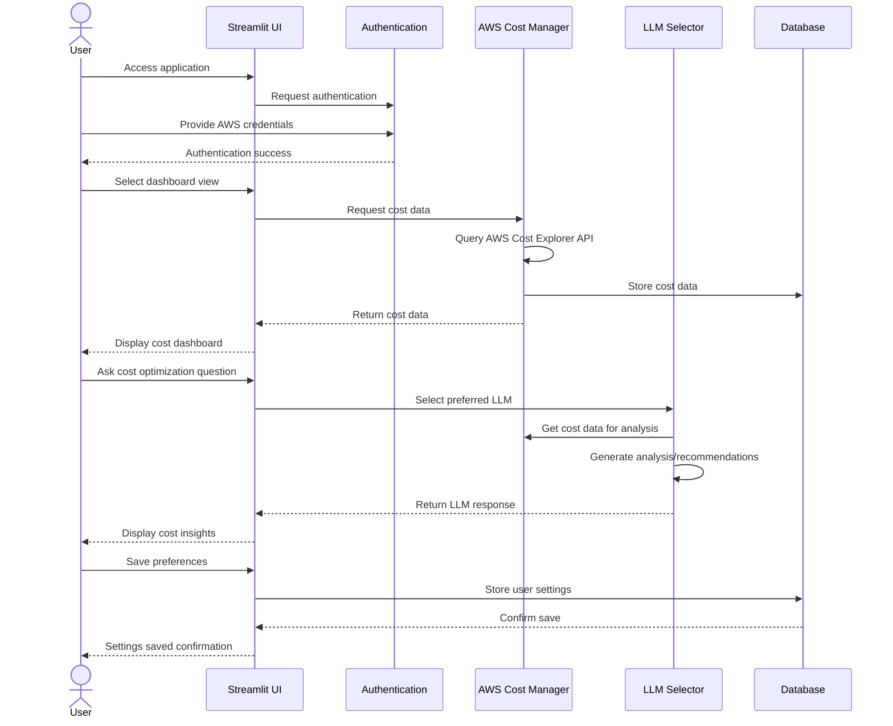
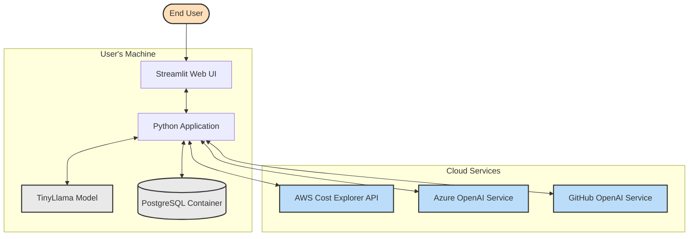
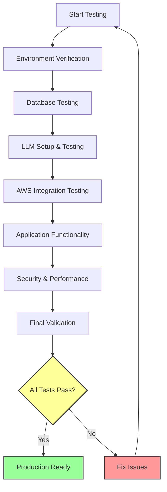
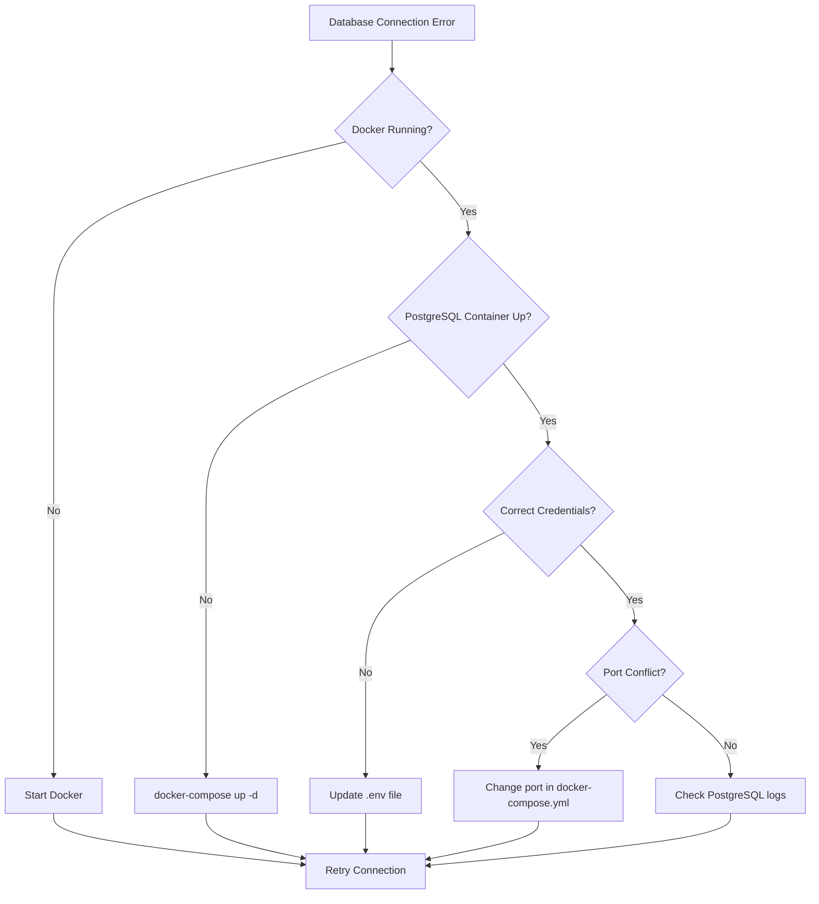

# AWS FinOps Application

A comprehensive FinOps solution for AWS cost management and optimization using multiple LLMs (GitHub OpenAI, Azure OpenAI, TinyLlama), Hugging Face, and LangChain.

## Overview

This application provides a full-featured AWS cost management and optimization platform with:

- AWS cost monitoring and analysis by service, region, and usage type
- AI-powered cost forecasting using multiple LLM options (GitHub OpenAI, Azure OpenAI, local TinyLlama)
- Intelligent cost optimization recommendations
- Interactive chat assistant for natural language queries about your AWS costs
- PostgreSQL database for historical cost data storage and analysis
- Streamlit UI for an intuitive user experience

## Architecture

### System Architecture Diagram



## Features

- **AWS Cost Analysis**
  - Real-time cost data retrieval using the AWS Cost Explorer API
  - Cost breakdown by service, region, and usage type
  - Interactive visualizations and reports

- **AI-Powered Forecasting**
  - Cost forecasting using both AWS Cost Explorer and AI models
  - Historical trend analysis
  - Anomaly detection

- **Cost Optimization**
  - Intelligent recommendations for cost savings
  - Resource right-sizing suggestions
  - Reserved instance and Savings Plans analysis

- **Natural Language Chat Interface**
  - Query your AWS cost data using natural language
  - Get insights and recommendations through conversation
  - Powered by three LLM options: GitHub OpenAI, Azure OpenAI, and local TinyLlama

- **Local LLM with GPU Acceleration**
  - Utilizes macOS M3 GPU acceleration for TinyLlama model
  - Privacy-friendly option for cost analysis without sending data to external APIs
  
- **Multiple LLM Options**
  - GitHub OpenAI for powerful cloud-based inference
  - Azure OpenAI for enterprise-grade AI capabilities
  - TinyLlama for local processing with GPU acceleration

## Component Diagram



## Technology Stack

- **Backend**: Python 3.12
- **Frontend**: Streamlit
- **Database**: PostgreSQL (via Docker)
- **AI Models**:
  - TinyLlama (local inference with GPU acceleration)
  - Azure OpenAI (cloud-based inference)
  - GitHub OpenAI (cloud-based inference)
- **Frameworks**:
  - LangChain for LLM orchestration
  - SQLAlchemy for database operations
  - Pandas for data manipulation
  - Plotly for visualizations

## Prerequisites

- Python 3.12
- Docker and Docker Compose (for PostgreSQL)
- AWS account with Cost Explorer API access
- Azure OpenAI API access (optional)
- GitHub token with model access (optional)
- macOS with M3 chip for local LLM GPU acceleration

## Sequence Diagram



## Installation

1. Clone the repository:

```bash
git clone https://github.com/yourusername/cloud-finops-with-llm.git
cd cloud-finops-with-llm
```

2. Create and activate a virtual environment:

```bash
python -m venv venv
source venv/bin/activate  # On Windows: venv\Scripts\activate
```

3. Install the required dependencies:

```bash
pip install -r requirements.txt
```

4. Configure environment variables:

```bash
cp .env.example .env
# Edit .env with your AWS credentials, LLM API keys, etc.
```

5. Start the PostgreSQL database:

```bash
docker-compose up -d
```

6. Download the TinyLlama model for local inference:
   - The application will automatically download the model on first run
   - Or you can manually download it using the provided utility script:
   ```bash
   python utils/download_model.py
   ```

7. Run the application:

```bash
# Option 1: Using the shell script (recommended)
./run_app.sh

# Option 2: Using the Python launcher
python3 launch_app.py

# Option 3: Using main.py (which calls the launcher)
python3 main.py
```

## Configuration

Edit the `.env` file to configure:

- AWS credentials
- Azure OpenAI API settings
- GitHub OpenAI API settings
- PostgreSQL connection details
- Local LLM settings

### Key Environment Variables

```
# AWS Configuration
AWS_ACCESS_KEY_ID=your_aws_access_key_id
AWS_SECRET_ACCESS_KEY=your_aws_secret_access_key
AWS_DEFAULT_REGION=us-west-2

# Azure OpenAI Configuration
AZURE_OPENAI_API_KEY=your_azure_openai_api_key
AZURE_OPENAI_ENDPOINT=your_azure_openai_endpoint
AZURE_OPENAI_API_VERSION=2023-12-01-preview
AZURE_OPENAI_DEPLOYMENT_NAME=your_deployment_name

# GitHub OpenAI Configuration
GITHUB_TOKEN=your_github_token
GITHUB_OPENAI_ENDPOINT=https://models.github.ai/inference
GITHUB_OPENAI_MODEL=openai/gpt-4.1

# PostgreSQL Configuration
POSTGRES_USER=postgres
POSTGRES_PASSWORD=postgres
POSTGRES_DB=finops
POSTGRES_HOST=localhost
POSTGRES_PORT=5432

# Local LLM Configuration
LOCAL_LLM_MODEL_PATH=models/tiny-llama
LOCAL_LLM_USE_GPU=true
```

## Deployment Architecture



## Step-by-Step Usage Guide

### 1. Initial Setup and Login

1. Start the application:
   ```bash
   ./run_app.sh
   ```
2. Access the web interface at http://localhost:8501
3. In the sidebar, enter your AWS credentials and click "Login"
4. Once authenticated, you'll see your AWS account ID (partial) displayed in the sidebar

### 2. Dashboard Navigation

1. The "Dashboard" page shows an overview of your AWS costs:
   - Total cost for the selected period
   - Cost breakdown by service (pie chart)
   - Daily cost trend (line chart)
   - Top 5 services by cost (bar chart)

2. Use the date range selector in the sidebar to adjust the time period for analysis

### 3. Cost Explorer

1. Navigate to "Cost Explorer" from the sidebar
2. View detailed cost breakdowns by:
   - Service
   - Region
   - Usage Type
   - Tag (if tags are configured in AWS)
3. Use the filters to refine the cost data display
4. Export data as CSV for offline analysis

### 4. Cost Forecasting

1. Navigate to "Forecast" from the sidebar
2. Select the forecast period (30, 60, or 90 days)
3. Choose between AWS native forecasting or AI-powered forecasting
4. View the forecast charts and predictions
5. Get AI analysis of cost trends and potential future concerns

### 5. Cost Optimization

1. Navigate to "Recommendations" from the sidebar
2. View recommendations in two categories:
   - AWS-Generated: Direct from AWS Cost Explorer Recommendations API
   - AI-Generated: Created by analyzing your cost patterns with LLM
3. For each recommendation:
   - View the potential savings amount
   - Review the detailed justification
   - Use the "Implement" button to apply recommendations (simulated in this version)

### 6. Chat Assistant

1. Navigate to "Chat Assistant" from the sidebar
2. Type natural language questions about your AWS costs:
   - "What service cost the most last month?"
   - "Why did my EC2 costs increase in May?"
   - "How can I reduce my S3 storage costs?"
   - "Forecast my RDS costs for the next quarter"
3. The assistant will analyze your cost data and provide detailed responses
4. Select your preferred LLM for analysis in the sidebar:
   - Local TinyLlama for privacy-focused, on-device analysis
   - Azure OpenAI for powerful cloud-based analysis
   - GitHub OpenAI for advanced analysis capabilities

### 7. Settings

1. Navigate to "Settings" from the sidebar
2. Configure:
   - AWS region for data retrieval
   - LLM preferences (Azure OpenAI, GitHub OpenAI, or local TinyLlama)
   - UI preferences and default views
3. Changes are automatically saved to your user profile

## Production Readiness Testing

A comprehensive testing procedure has been developed to ensure this application is production-ready. The testing covers all critical components and confirms their functionality in a local environment before deployment.

### Testing Requirements

- **Hardware**:
  - Python 3.12
  - Docker and Docker Compose
  - macOS with M3 chip (for GPU acceleration)
  - Minimum 8GB RAM
  - At least 10GB free disk space

- **Accounts & Credentials**:
  - AWS account with Cost Explorer API access
  - Azure OpenAI account (optional)
  - GitHub token with model access (optional)

### Testing Process Flow



### Testing Steps

1. **Environment Verification**
   - Python version check with `python --version`
   - Dependency installation with `pip install -r requirements.txt`
   - Docker and Docker Compose availability check
   - System resource verification (RAM, disk space)
   - GPU availability check with `torch.backends.mps.is_available()`

2. **Database Testing**
   - PostgreSQL container startup with `docker-compose up -d`
   - Health check with `docker ps` and `docker logs`
   - Schema initialization with `utils/init_db.py`
   - Connection verification with `test_database.py`
   - Data persistence validation by storing and retrieving test records

3. **LLM Setup & Testing**
   - TinyLlama model download and verification
   - Inference testing with GPU acceleration using `test_local_llm.py`
   - Azure OpenAI connectivity check (if credentials provided)
   - GitHub OpenAI connectivity check (if token provided)
   - Response quality validation against benchmark prompts

4. **AWS Integration Testing**
   - Credential validation with `test_aws_connection.py`
   - Cost Explorer API access verification
   - Cost data retrieval testing
   - Data transformation and storage in PostgreSQL
   - Error handling and retry mechanism validation

5. **Application Functionality**
   - Streamlit UI rendering check
   - Authentication flow testing
   - Cost visualization accuracy validation
   - LLM-powered recommendations quality assessment
   - Chat interface functionality testing
   - Cross-page navigation testing

6. **Security & Performance**
   - Authentication mechanism verification
   - API key management and security
   - Response time benchmarking for different operations
   - Load testing with larger datasets
   - Memory usage monitoring with different LLM options

### Test Results and Verification

Detailed testing results are available in [testing_logs/test_results.md](testing_logs/test_results.md)

Each test includes:
- Test name and description
- Expected results
- Actual results
- Pass/fail status
- Any error messages or warnings
- Screenshots or logs where applicable

## Troubleshooting Common Issues

### Database Connection Issues



1. **PostgreSQL Container Not Starting**
   - Check Docker status: `docker ps`
   - Check container logs: `docker logs postgres`
   - Verify port availability: `lsof -i :5432`
   - Rebuild container: `docker-compose down -v && docker-compose up -d`

2. **Authentication Issues**
   - Verify credentials in `.env` file match `docker-compose.yml`
   - Reset database: `docker-compose down -v && docker-compose up -d`
   - Run initialization script: `python utils/init_db.py`

### LLM Issues

1. **TinyLlama Loading Problems**
   - Check model path in `.env`: `LOCAL_LLM_MODEL_PATH=models/tiny-llama`
   - Verify model files exist: `ls -la models/tiny-llama`
   - Re-download model: `python utils/download_model.py`
   - Check GPU acceleration: `python -c "import torch; print(torch.backends.mps.is_available())"`

2. **Quantization Errors**
   - Update bitsandbytes: `pip install -U bitsandbytes`
   - Disable quantization by setting environment variable: `export DISABLE_QUANT=1`
   - For M3 chips, make sure MPS acceleration is working correctly

3. **GitHub/Azure OpenAI Connectivity**
   - Verify API keys and endpoints in `.env`
   - Check network connectivity to API endpoints
   - Ensure token has correct permissions

## Future Development

Planned enhancements include:

1. **Cost Anomaly Detection**
   - Automated identification of unusual spending patterns
   - Alert notifications for cost spikes

2. **Resource Utilization Analysis**
   - Integration with CloudWatch metrics
   - Idle resource identification

3. **Multi-Cloud Support**
   - Extend to Azure and GCP cost management
   - Unified cross-cloud dashboard

4. **Export and Reporting**
   - Scheduled PDF/CSV reports
   - Integration with BI tools

## License

MIT

## Contributing

Contributions are welcome! Please feel free to submit a Pull Request.
